Recipe mod for 1.21.1 made by GK1H.
<h1>Features</h1>

Bundle

Bundle recipe, if Metal Bundles is loaded instead disables bundle recipe and replaces the leather bundle recipe from Metal Bundles.

Chain

Better chain recipe and chainmail armor recipes.

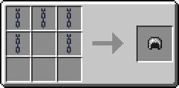
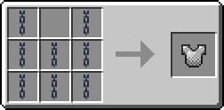

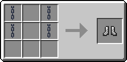

Enchanted Golden Apple

Enchanted golden apple recipes, including both using an apple and using a golden apple.

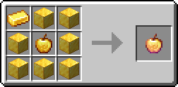
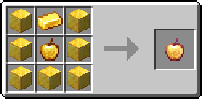

Heavy Core

Heavy core duplication recipe.

Horse Armor & Saddle

Horse armor & saddle recipes, including modifying the leather horse armor recipe to match the other horse armor recipes.

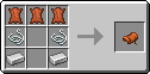

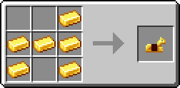
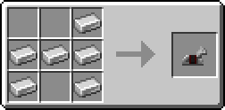
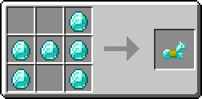

Lead

Backported lead recipe.

Lodestone

Backported lodestone recipe and if Advanced Netherite is loaded its lodestone recipes are removed.

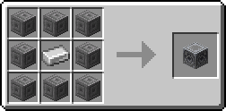

Netherite Ingot

Netherite ingot recipe.

Smithing

Smithing recipes for Metal Bundles, diamond bundle to netherite bundle, and Spiky Spikes, diamond spike to netherite spike.

Tuff & Netherrack

Tuff & netherrack recipes.

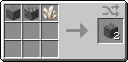
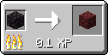

Totem of Undying

Totem of Undying recipe.

Modrinth: https://modrinth.com/mod/gk1h-recipes  
CurseForge: https://curseforge.com/minecraft/mc-mods/gk1h-recipes  
Discord: https://discord.gg/AwJvGzH